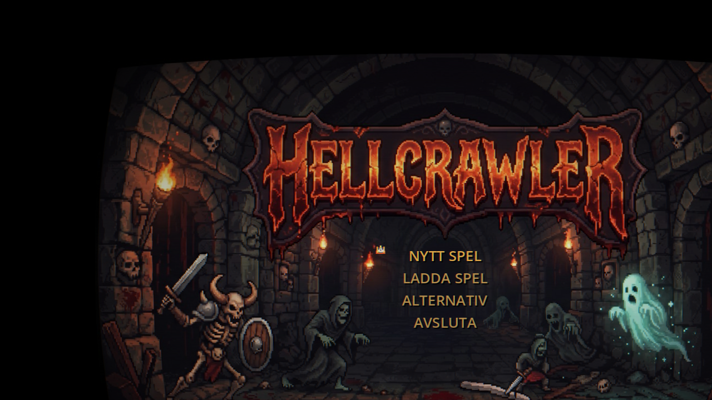
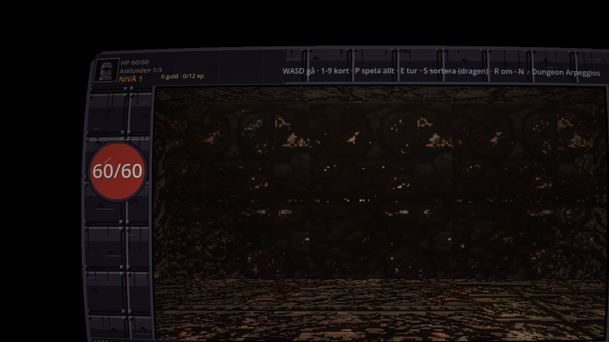
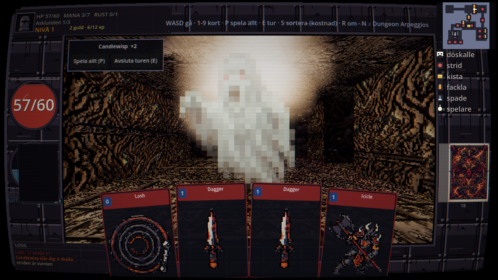
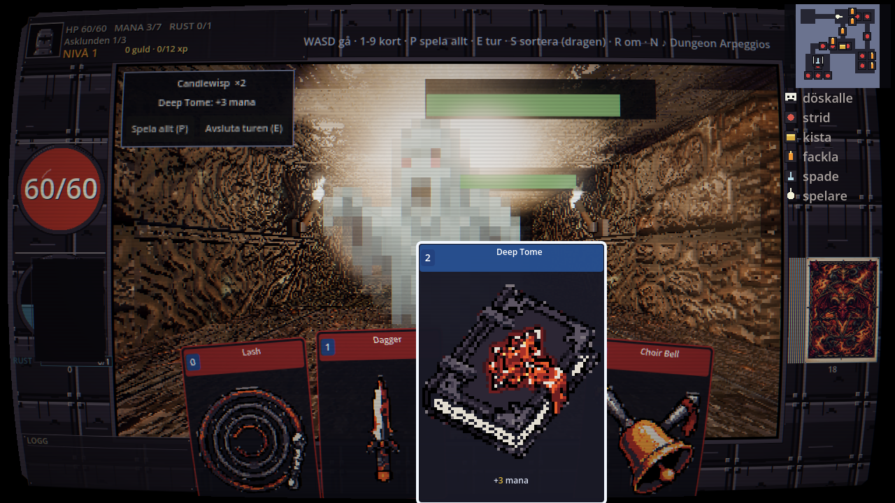
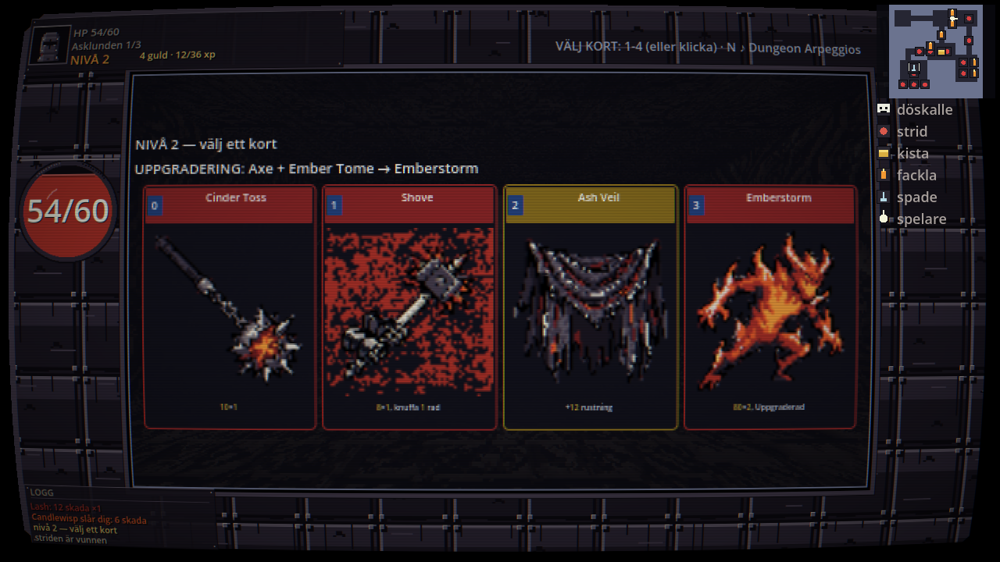

# HellCrawler — egen version av "blobber + deckbuilder"

Förstapersons rutnätsdungeon med turordningsbaserad kortstrid, i Godot 4 (GDScript, ingen plugin).
All spelmekanik ligger headless i `game/core/` — grafiken är ett skal ovanpå, inte en förutsättning.

Namnet (Alex förslag 2026-09-19) säger vad spelet gör: man gräver sig nedåt, en våning i taget, mot
något värre. Shoveln är inte en inventariepryl utan spelets riktning, och de åtta temana — Asklunden,
Koppargruvan, Myrmarken, Vitkalken, Benkammaren, Saltgruvan, Klocktornet, Glashyttan — är lager på
väg ned. Referensbygget heter något annat och har egna namn, rum och konst; inget av det återanvänds.

## Kom igång

Kräver **Godot 4** (byggt och testat på 4.7.2) och **Linux**. Inget mer: GDScript, inga plugins, ingen
byggnad. Spelkoden är källkoden — det du hämtar är det som körs.

```bash
git clone https://github.com/alexwest1981/HellCrawler.git hellcrawler
cd hellcrawler
./install.sh      # startikon i startmenyn
```

`install.sh` skriver posten utifrån var du lade kopian — inga sökvägar är hårdkodade — och lägger på
körbiten på `tools/play.sh` (en hämtad zip tappar den). Utan ikon går spelet att starta direkt:

```bash
tools/play.sh
```

Uppdatera till senaste versionen:

```bash
./update.sh
```

Har du laddat hem en zip i stället för att klona kan skriptet inte uppdatera kopian; hämta zip-filen
på nytt då. Ser du inte startikonen i menyn direkt: starta om skalet/fältet — menyerna läser sina
poster vid start.

## Styra spelet

| Tangent | Gör |
|---|---|
| `W A S D` | gå i korridoren |
| `1`–`9` | spela ett kort ur handen |
| `P` | spela hela handen |
| `E` | avsluta turen |
| `S` | sortera handen (dragen) |
| `R` | börja om körningen |
| `N` | byt musikspår (7 spår) |

HUD:en visar hälsa, mana för turen, rustning, loggen och minikartan uppe till höger. Fler tangenter
finns i koden (`_input_shell`, `game/main.gd`) — tabellen ovan är de som står i spelets egen hjälprad.

## Var spelet sparar

Allt ligger i Godots användarmapp, utanför repot:

```
~/.local/share/godot/app_userdata/HellCrawler/
```

Där ligger `save.json` (guld, splittrar, träd, samlingen) och skärmbilder du tar med `-- shot`. Vill du
börja helt om: ta bort mappen — **avinstallationen rör den inte**, `./install.sh --uninstall` tar bara
bort startikonen.

## Prov och verktyg

```bash
tools/test.sh                 # hela sviten headless (1590 kontroller)
python3 tools/gen_props.py --check       # grinden på rekvisiderna
python3 tools/gen_enemy_art.py --check   # grinden på fienderna
tools/play.sh -- shots        # fotografera en genomspelning
```

Spelflaggorna står **efter** `--` (spelet läser `OS.get_cmdline_user_args()`):

```bash
tools/play.sh -- dekor=0               # stäng av markdekorationen
tools/play.sh --audio-driver Dummy     # tyst körning
```

## Vad som är otillräckligt testat

Sagt rakt ut, för det står inte i något prov: **spelet är bara kört på Linux**, med NVIDIA-vulkan. Windows
och macOS är oprövade, och det finns ingen paketering för dem. Ljudet är byggt men aldrig dömt av ett
öra i en riktig högtalare. Fiendekonsten är genererad och sedan granskad i bild; en del av arkens
isometriska föremål används inte, eftersom de inte fungerar som upprätta billboards.

## Skärmbilder











Fler: `docs/skarmbilder/` (01-10 från skalet, 13-17 ur en körning). Hela genomspelningen går att
fotografera själv — se `-- shots` nedan.

## Genvägen till spelet

```bash
./install.sh          # lägger in en startikon i startmenyn, pekar på den här kopian
./install.sh --uninstall
```

Skriptet skriver posten i `~/.local/share/applications/hellcrawler.desktop` **utifrån var du hämtade
kopian** — inga sökvägar är hårdkodade, så den fungerar var du än lade den. Det pekar på
`tools/play.sh` och på en ikonbild i `game/assets/`. Ser du inte ikonen direkt i menyn: starta om
skalet/fältet, menyerna läser sina poster vid start.

## Uppdatera

```bash
./update.sh
```

Hämtar senaste versionen från GitHub och lägger in den i den här kopian. Spelet har ingen byggnad, så
det är allt som behövs — och startikonen behöver inte läggas om, eftersom sökvägen inte ändras. Har du
egna ändringar i trädet läggs de undan (`git pull --ff-only --autostash`) och tillbaka efteråt.
Är kopian en zip och inte en klon säger skriptet till: ladda hem zip-filen på nytt i stället.

`tools/hellcrawler.desktop` är den gamla handkopierade posten (med hårdkodad sökväg). Den behövs inte
längre — `install.sh` genererar en riktig post i stället.

## Backup

Repot är **privat**: `github.com/alexwest1981/HellCrawlers`. Källarken som spelets fiender och
hjältar är klippta ur (`game/images/`, fem JPEG) följer med i repot; resten av bildmaterialet är
ignorerat av utrymmesskäl. Ändra inget i `game/assets/` för hand — kör generatorerna i `tools/`,
de är källan till konsten.

## Starta allt — kommandolistan

```bash
cd ~/Projects/hellcrawlers

tools/play.sh                    # spelet
tools/play.sh -- stage=stage_05 vaning=2   # börja på annan bana/våning (1 = första)
tools/editor.sh                  # karteditorn
tools/editor.sh stage_05 2       # editorn på en viss bana/våning
tools/test.sh                    # hela sviten: konsten, ljudet, språket, alla tester
```

`tools/test.sh` är det enda du behöver köra för att veta om något gått sönder. Den kör i tur och
ordning: `gen_tiles.py --check` (rutorna), `gen_sfx.py --check` (ljudet), `gen_enemy_art.py --check`
(fienderna), `gen_fx.py --check` (partiklarna), `gen_props.py --check` (rekvisiten), `gen_i18n.py
--check` (de 13 språkfilerna), och sedan varje `game/tests/test_*.gd`.
Utdata är en rad per kontroll — `ok` eller `FEL` med orsaken — och sista raden säger summan.

Konsten och ljudet är **genererade**, inte ritade för hand, så de går att köra om:

```bash
python3 tools/gen_enemy_art.py             # skriv om fiendebilderna (17 st, 6 rutor var)
python3 tools/gen_enemy_art.py --check     # mät i stället för att skriva
python3 tools/gen_enemy_art.py --sheet     # kontaktkarta att döma med ögonen
python3 tools/gen_tiles.py                 # väggar, golv, tak — 5 teman x 5 rutor
python3 tools/gen_tiles.py --check         # mät i stället för att skriva
python3 tools/gen_tiles.py --sheet         # kontaktkarta: alla teman att döma på bild
python3 tools/gen_props.py                 # rekvisiten på golvet: kista, spade, benhög
python3 tools/gen_props.py --check         # mät formen: sträcka, silhuett, kontur, palett
python3 tools/gen_props.py --sheet         # kontaktkarta att döma med ögonen
python3 tools/gen_sfx.py                   # ljudeffekterna
python3 tools/gen_i18n.py                  # språkfilerna (13 st)
python3 tools/gen_art.py --missing         # kortikoner via bildmodellen (bara de som saknas)
```

`gen_art.py` är det enda verktyget som går mot ett moln-API (bildmodellen, kvot ~9 bilder per 5 h),
och det är därför 54 kortikoner fortfarande saknas — cron-jobbet `b8ad3b5af7fb` tar dem i tur och
ordning. Allt annat är lokalt och tyst.

## Kör spelet

```bash
tools/play.sh
```

Spelet börjar i **byn**. Därifrån:

| tangent | vad |
|---|---|
| `1` | Världskartan — välj bland banorna du låst upp (`←/→`, `Enter` går in) |
| `2` | Butiken — permanenta uppgraderingar, `1`-`9` köper |
| `3` | Värdshuset — hyr en kamrat för guld, `1`-`9` hyr |
| `4` | Smeden — nodnätet: `←/→` byter gren, `1`-`9` köper små steg |
| `L` | byt språk (13 språk) |
| `Q` | avsluta |

**Smeden** har fyra grenar av små steg med stigande pris (Järnvägen: skada · Benknippet: kropp ·
Glöden: mana och handkort · Girigheten: starkare fiender mot mer guld). Noderna kräver varandra, och
en låst nod visar både priset och vad som fattas.

**Kamraterna** (Värdshuset) blir egna kort i din lek: de spelas som andra kort, och så länge kortet
finns i leken ger de sin verkan varje tur — `+1 mana`, `+1 kort på handen`, `+5 max-HP`, `+10 % skada`,
`+1 rustning` eller `+2 HP` läkt efter varje strid.

Klara en bana (nå sista våningen) och nästa låses upp — `T` på slutskärmen tar dig tillbaka till byn
med guldet i banken.

Stäng av fönstret när du vill. Öppnar ett fönster på din skärm — inget jag startar åt dig.

Vill du börja på en annan bana eller våning (t.ex. en du ritat själv):

```bash
tools/play.sh -- stage=stage_05 vaning=2     # bana och våning (1 = första)
```

**Tangenter:** `w` framåt · `a`/`d` sväng vänster/höger (pilarna går också) · `r` ny körning.
**I strid:** `1`-`9` spela kortet · `p` spela allt (solvern) · `e` avsluta turen · `s` sortera handen
(dragen → kostnad → roll). För muspekaren över ett kort och det **träder fram** (lyfter ur
solfjädern med en liten översläng, grannarna viker undan, effekten syns) — och stridspanelen märker
**vilka fiender kortet träffar och för hur mycket**.

Fienderna i den strid du står i har en **healthbar** över huvudet: grön, gul, röd. Den visar bara
den här stridens fiender, och den krymper från höger, så "vilken är på väg att dö" syns utan att
räkna. **Slår du** får du fyra svar samtidigt: **vapnet** far genom bilden — ett blad som skär, en piska som
snärtar, en klubba som landar, ringar från klockan, formen kommer ur kortet du spelade och färgen ur
kortets typ — en siffra stiger bredvid fienden (vit vid ×1, gul vid ×2, orange vid ×3 och vid dråp),
figuren blinkar till och knuffas bakåt, och tar du själv stryk blinkar vyn röd. **Minikartan** i övre högra hörnet visar hela våningen med egna märken: döskalle
för bossen, liten prick för strider, kista för kistor, låga för facklor och en shovel.
**Korten ligger längst ned**, strax ovanför underkanten, så 3D-vyn får plats.

Kedjan är spelets kärna: korten spelas i **stigande mana-ordning** och varje steg multiplicerar
nästa korts effekt. Samma kostnad två gånger i rad bryter kedjan; wild-kort (W) bryter den aldrig.
Manapoolen är taket för hur lång kedjan kan bli. Reglerna står i `game/core/rules.gd`.

Vyn just nu: väggar/golv/tak är genererade 32×32-rutor i **fem teman** (asklunden, krypta, grotta,
tunnel, bro) — banan väljer tema per våning, och karteditorn byter det med `T`/`Y`. Rutorna är
**2.5D**: varje ruta har en normal- och en ORM-karta (råhet i grönt, metall i blått) räknade ur
paletten, så sten är matt, ben och trä halvblankt och **vatten speglar** (SSR). Speglingen följer råheten:
ytor mattare än 0,80 får ingen alls (annars blir stenen en mjölkhinna — mätt i M27), så högdagrarna
hamnar på mossen, sprickan, benet, träet och rekvisitan medan stenen förblir matt. Kontaktkartor att döma
på bild: `python3 tools/gen_tiles.py --sheet` → `assets/tiles/_teman.png` och `_teman_normal.png`.
Våningen är **mörk och lyses upp av lyktan i handen** (avfall 2,8× mellan nära och långt håll),
facklorna i våningen brinner med fladder, varje tema har sitt eget omgivningsljus och sin dimma, och
lyktan kastar skuggor (kostar inget mätbart vid 60 fps). Prova nivåerna utan att bygga om:
`godot --path game -- shots stage_21 lykta=6 omgivning=0.05 skugga=0 ssr=0 ao=0 fx=0`.
**`kartor=0` är till för att stänga AV normal- och ORM-kartorna** när man vill se bara ljuset — med
den flaggan är stenen platt med flit. Spela med kartorna på (ingen flagga alls).

**Normalmappningen, mätt** (`-- normalprov=0|1`): Alex såg våningen som platt trots att rutornas
normal-kartor lutar 15-20 grader. Mätt i EN körning, samma kamera, fyra bilder där `normal_scale`
sätts på materialet som FAKTISKT ritas (11 material med albedo-, normal- och ORM-karta; inget
`material_override` ligger i vägen, och mesharna bär både UV och tangenter — utan tangenter hade
kartan förkastats tyst):

| normal_scale | skillnad mot 0,0 (medel / p99, 0-255) | korrelation med målade högdagrar |
|---|---|---|
| 1,0 (spelets värde) | 5,6 / 64 | +0,26 |
| 2,0 | 9,8 / 81 | +0,27 |
| 3,0 | 12,3 / 92 | +0,28 |
| 4,0 | 13,9 / 98 | +0,28 |
| 0,0 igen (brusgolv) | **0,02 / 1** | −0,04 (reliefens spridning 0,1: ingen) |

Siffrorna är mätta i spelvyn (960x540 i ett 1280x720-fönster — HUD:en och de svarta kanterna är
utanför och späder ut siffran till 3,2 / 40 om man mäter hela fönstret). Brusgolvet är 0,02, alltså
280 gånger lägre än signalen vid spelets eget värde: kartan når shadern. Korrelationen säger att
reliefen lägger skuggan där konsten redan målat den — den förstärker målningen i stället för att
motverka den. `-- normalprov=0,1,2,3` tar en svepning i stället för de fyra fasta bilderna, och
`python3 tools/normalprov.py [--relief] <bilder>` räknar |a−b| per pixel i numpy. Provet som biter
ligger i `tests/test_normalprov.gd`: det fäller om en yta som RITAS saknar sin normalmap, sin
ORM-karta eller sina tangenter (mätt: 11 material bär en normal_texture, 0 ligger bakom ett
`material_override`, och de ritas av en MultiMesh med tangenter).

**Glansen, mätt** (`-- glansprov` = facklan i bild, `-- stage=stage_12 vaning=1 glansprov=pöl` = vattnet):
`light_specular` var 0,0 på lyktan och facklorna, så ingen yta kunde få en högdager. Slås den på utan
vidare blir stenen mjölkig — Godots dielektriska spegling är FAST 4 % (`specular` finns inte i Godot 4;
skrivningen gör ingenting) och en sten med råhet 0,94 får då en lob som är nästan ett halvklot.
Speglingens läge följer därför materialets EGEN ORM-råhet: mattare än 0,80 = ingen spegling, blankare =
GGX. A/B i en körning, samma kamera (960x540-vyn ur 1280x720):

| bild | glans | ytorna | medel | p50 | mörkt |
|---|---|---|---|---|---|
| 01 läget före | 0,0 | GGX | 0,1720 | 0,0941 | 59 % |
| 02 naivt | 1,0 | GGX | 0,2141 | 0,1464 | 50 % |
| 03 flit-bort | 1,0 | alla AV | 0,1779 | 0,0941 | 58 % |
| 04 **spelet** | 1,0 | tröskel 0,80 | **0,1767** | **0,0941** | 58 % |
| 05 brusgolv (samma som 01) | 0,0 | GGX | 0,1726 | 0,0928 | 59 % |

|a−b| mot bild 01 är 19,8 i medel och 70 i p99 för det naiva läget, 3,7 / 57 för spelets och 1,2 / 14
för brusgolvet: medianen står stilla, så högdagrarna ligger i ytorna i stället för som en hinna över
rummet. **Metallen på järnet och på vattnet är mätta NEJ:** `metallic` 0,7 gjorde rekvisiten mörkare (ner
till −126 av 255 i enstaka bildpunkter, ingen ljus högdager i rutan — vision: *"darker and flatter"*),
och vattnets `glans` 0,70 sänkte p99 i pöl-läget 0,75 → 0,67. Glansen bor där råheten redan sa att den
skulle: mossen (0,65), sprickan (0,68), benet (0,45-0,60), träet (0,72) och rekvisitan — stenen
(0,93-1,00) förblir matt. Bilder och alla led ur samma körning: `godot --path game -- glansprov`.

**Effekterna** (`game/core/fx.gd`, konsten i `tools/gen_fx.py`): varje fackla är en eldstad med en
låga som slicks uppåt, rök, glödande gnistor och ett eget fladdrande ljus. Vatten finns som målade
pölar och strimmor på väggarna — pölen har en blank platta i vattnets EGEN form med en krusning som
rullar (kort sagt: den är blöt), och droppar faller från taket ner i den och längs väggarna. Damm
driver i lyktskenet. Allt är Godots egna partiklar och gradienter, inga bildfiler och en enda shader.
Att döma formerna på bild: `python3 tools/gen_fx.py --sheet` → `assets/fx/_former.png`.
`fx=0` stänger av effekterna; `tak=0` stänger av takdroppet; `fackelprov stage=X` går till facklan och
fotograferar den på håll.

**Takdroppet** (M21): 3-6 ställen per våning där vatten, slem, blod eller lava faller — ur
våningens eget frö, så samma våning ser likadan ut varje gång. **Det droppar, det rinner inte**
(Alex: "ser ut som det rinner"): ett ställe väntar 2-6 s mellan dropparna, ett enstaka ställe är
accent och väntar 0,6-1,6 s, och väntan dras om varje gång så takten är ojämn. MÄTT före: `takt`
skalade droppens livstid, och i kontinuerligt läge släpper en GPUParticles3D `amount / lifetime`
partiklar i sekunden — 4 partiklar / 0,35-1,1 s = **3,6-11 droppar i sekunden per ställe**, med
~25 ställen per våning: 200 droppar i sekunden. Det är en kran. Nu är varje ställe en droppe per
gång (`one_shot`, `amount = 1`) och klockan ligger i `main.gd` (`_droppa`), med falltiden orörd —
droppen försvinner när den når marken. Provet i `tests/test_fx.gd` räknar droppar PER MINUT ur
`Fx.dropp_väntan`, samma funktion som spelet använder, och fäller under 10/min. Våningens droppar
ligger på 15,6/min i snitt (2,0-6,0 s väntan). Krusningen i pölen rullar 0,03 UV/s ≈ 4 mm/s över en
halvmeterspöl — den är inte orsaken till att ett rum läser som rinnande vatten, och är orörd.
`nodprov=dropp stage=X` går till ett av ställena och STARTAR droppen, så bilden inte blir tom luft.
`nodprov=<chest|shovel|boss> stage=X` gör samma sak för en nod på golvet — en nod man står PÅ har man
inne i kameran, och då mäter bilden ingenting.

**Läsbarheten på golvet** (M20): noderna var 8×8-schackrutor i nodens färg, grottgolvet hade ljusa
stenfläckar (17 % av rutan) och pölarnas kanter var 1-bits dither. Rekvisiten ritas av `gen_props.py`,
golvet är två ton, och pölmasken samplas med mipnivåer. Allt tre var saker en spelare inte kunde sätta
namn på — mät dem på bild före och efter: `--sheet` och `nodprov=`.

## Evolutionerna: två kort blir ett

`data/evolutions.json` (17 recept) + `data/cards/04_evolutioner.json` (15 kort). Ett kort märkt
`Evolved` kommer BARA ur sitt recept: båda delarna tas ur leken, resultatet läggs in (netto −1 kort),
och kortvalet erbjuder högst en uppgradering per val, bara när delarna ligger i leken, med receptet i
klartext under rubriken (`UPPGRADERING: Axe + Ember Tome → Emberstorm`). Motorn är `game/core/evolution.gd`.
Mätt med standardspelaren i `tools/balance.gd -- 20 <bana> <rang> <evo>` (`evo` 0 = läget före):
stage_05 svårighet 2 gick från 4/20 till **16/20** klarade banor, stage_09 svårighet 3 med rang 2 från
2/20 till **17/20**. Provet som biter ligger i `tests/test_evolution.gd` (48 kontroller); med delarnas
konsumtion avstängd faller 9 av dem. Fotografera valet: `tools/play.sh -- kortvalsprov` (skriver
`user://shots/kortval.png` och texten i valet). **Mätaren i `tools/balance.gd` mätte fel före M28** —
leken delades mellan körningarna (20 → 34 kort) och kortvalen besvarades efter körningen; se M28 i
PLAN.md.

## Rita banorna (karteditorn)

```bash
tools/editor.sh                 # stage_01, våning 1
tools/editor.sh stage_05 2      # bana och våning — våningen räknas som du gör: 1 = första
```

Våningarna behöver inte genereras. Editorn ritar en våning och sparar den till
`game/data/maps/<bana>_<våning>.json` — och då **gäller den filen**: `core/dungeon.gd` använder den
i stället för generatorn, för just den våningen. Våningar du inte ritat genereras som förut, så du
kan bygga en bana våning för våning.

**I editorn:** `1`-`6` väljer nod (start, strid, boss, nedstigning, kista, fackla) · `G`/`V` väljer
golv/vägg · vänsterklick ritar, högerklick suddar · `S` sparar · `L` läser om · `N` ny tom yta ·
`P` spelar din våning direkt · `[` `]` byter våning · `Q` avslutar. Panelen till höger visar
tangenterna och vad som står under pekaren.

**Grinden:** en våning som inte går att spela får inte sparas. Exakt en start, en boss och en
nedstigning, minst fyra strider, inga noder i väggar, och allt måste gå att nå från starten — samma
kontroller som en genererad våning måste klara. Går det inte, står felet i panelen i stället för att
filen skrivs. Filen är läsbar och handredigerbar: `#` är vägg, `.` är golv, noderna ligger för sig.

Startar du editorn utan ritad fil får du generatorns våning som utgångsläge — rätta den och spara.

## Se spelet utan att sitta vid skärmen

```bash
`tools/play.sh -- shot     # en skärmbild efter en sekund, sparar och avslutar`
`tools/play.sh -- shots     # spelar igenom hela körningen och fotograferar varje skärm`  # kräver: godot --rendering-driver opengl3, annars står den bara och tuggar
tools/play.sh -- skarmar  # fotografera skalet: byn, butiken, kartan och en låst bana
tools/play.sh -- shots    # SPELAR HELA KÖRNINGEN och fotograferar varje skärm
```

`-- shots` går genom exakt samma funktioner som tangenterna anropar och skriver
`~/.local/share/godot/app_userdata/HellCrawler/shots/`. Det är så UI:t verifieras här: kör, titta på
bilderna, rätta, kör igen. Det var så tre layoutfel och ett spelstoppande fel i nedstigningen
hittades (shoveln ligger på bossens ruta — `node_here()` returnerade den avklarade bossen, så
man kunde aldrig komma ned från våning 1).

Kan köras på en virtuell skärm utan att störa någon:

```bash
Xvfb :99 -screen 0 1280x720x24 +extension GLX & 
DISPLAY=:99 tools/play.sh --rendering-driver opengl3 -- shots
```

## Byn, guldet och sparfilen

Körningen tar slut, byn består. Guldet du samlar går till en **bank** när körningen är över, och
slutskärmen ÄR byn: `1`-`8` köper permanenta uppgraderingar, `R` startar en ny körning med dem
inräknade. Uppgraderingarna ligger i `game/data/powerups.json` — en ny är en rad där, inte en
kodändring.

Sparfilen ligger i `user://save.json` (`~/.local/share/godot/app_userdata/HellCrawler/save.json`) med
`save_version` från första versionen. Den skrivs **atomiskt** (temp-fil + namnbyte), så en krasch
halvvägs inte kan lämna en halv fil. Saknad fil är en ny spelare. Är filen **trasig** döps den om
till `save.json.trasig` i stället för att skrivas över, och skälet skrivs ut — framsteg ska inte
kunna försvinna i tysthet. En fil från en **nyare** version av spelet rörs inte alls; spelet säger
till och kör vidare utan meta.

Vad uppgraderingarna gör, mätt med `tools/balance.gd` på svårighet 3 (20 körningar per rad):

| Ranger | Klarade banan | Median våning | Döda |
|---|---|---|---|
| 0 (standard) | 0/20 | 1 | 20 |
| 1 | 4/20 | 2 | 16 |
| 2 | 11/20 | 4 | 9 |
| 3 | 16/20 | 4 | 4 |

```bash
cd game && godot --headless --path . --script res://tools/balance.gd -- 20 stage_09 3
```

## Innehåll

61 kort i `data/cards/` (39 start + 22 i `02_expansion.json`), 40 banor (200 våningar), 8 permanenta
uppgraderingar och 7 effekt-nyckelord i motorn: `damage`, `armor`, `heal`, `mana`, `draw`,
`knockback` (knuffa bakåt i raden) och `freeze` (står över N turer). Ett nytt kort är en rad i JSON;
en ny effekt är en rad i `_apply_effects` **och** i `Combat.OPS`, som provet jämför kortdatat mot.

## Kör testerna

```bash
~/Projects/hellcrawlers/tools/test.sh
```

Kör `--import` först och sedan alla sviter. 120 kontroller: regler (29), dungeon (15, över
1 000 genererade våningar), handvy (9), körning (18), UI-vägen (18), progression (22) och
assets (9: varje kort har en 64×64-bild i paletten, alla ljud går att spela upp).
Exit != 0 = fel. Just nu röd på **en** kontroll: 30 kort saknar bild (kvoten för bildmodellen,
se nedan).

## Mät balansen

```bash
godot --headless --path ~/Projects/hellcrawlers/game --script res://tools/balance.gd -- 20
```

20 körningar per bana med standardspelaren: hur ofta man når våning 2, klarar banan, mediannivå.
Exit != 0 om svårighet 1 blivit för hård.

## Konst och ljud (genereras, laddas inte ner)

```bash
python3 tools/gen_art.py --missing      # kort som saknar bild (39 kort = 39 ikoner)
python3 tools/gen_art.py --only lash    # ett kort
python3 tools/gen_art.py --dry          # visa prompten, rör inga pengar
python3 tools/gen_art.py --sheet        # kontaktkopia att döma kvaliteten på
python3 tools/gen_sfx.py                # nio spelljud ur oscillatorer
python3 tools/gen_sfx.py --check        # mät att ljuden finns och är rimliga
```

Bilderna kommer från bildmodellerna som redan är inkopplade i OmniRoute (`localhost:20128`), och
går genom samma efterbehandling varje gång: 64×64, heltalsskalning till rutan, kvantiserade mot
`game/assets/palette.json` och bakgrunden borttagen. Paletten är **en** fil som både generatorn
och `tests/test_assets.gd` läser — driver de isär märks det i sviten.

Priset är några cent per kort. Generatorn växlar rutt själv när en modell svarar 429.

## Spela i text (ingen grafik)

```bash
godot --headless --path ~/Projects/hellcrawlers/game --script res://tools/play_text.gd -- stage_01 42
```

Samma motor som testerna; klienten är bara in- och utmatning. `w`/`a`/`d` gå, `p` auto,
`f` kör klart, `1`-`9`/`p`/`e` i strid, `q` avsluta.

## Dokumentation

- `RAPPORT.md` — hur referensen är byggd och vad en egen version kräver
- `PLAN.md` — målbild (80+ kort, ~40 banor, QoL-moddar inbakade) och milstolpar med mätt läge
- `research/` — underlaget, fem delrapporter + 79 råa källfiler
